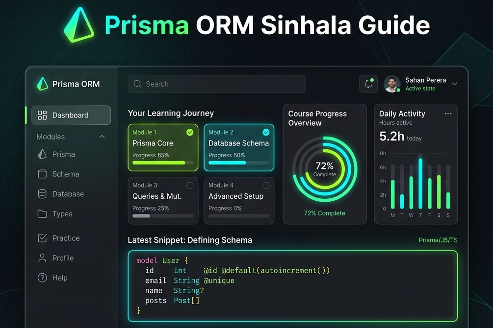
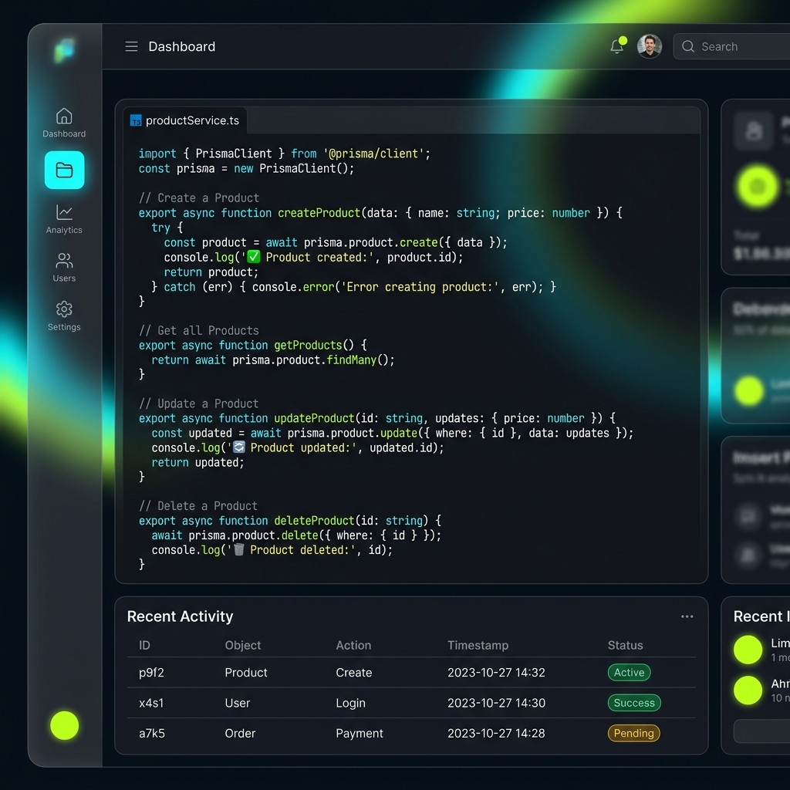

# 🌐 Prisma ORM Complete Sinhala Guide

<div align="center">




</div>

## 📋 Overview

The **Prisma ORM Complete Sinhala Guide** is a high-fidelity, interactive educational tool designed to help developers master modern database management using Node.js and TypeScript. From initial project configuration to advanced relationship logic and error handling, this guide demystifies complex ORM concepts through granular code examples, real-world scenarios, and a clean, localized learning experience.

### ✨ Key Features

- 📖 **Comprehensive Sinhala Guide** - Deep dive into Prisma ORM from beginner to advanced topics.
- ⚙️ **Practical Setup Tutorials** - Step-by-step instructions for Node.js, TypeScript, and SQLite/PostgreSQL.
- 📋 **Schema & Data Modeling** - Detailed explanation of Prisma Schema, field types, and technical attributes.
- 🔄 **Migration Management** - Mastering Prisma Migrate to version-control database changes seamlessly.
- ✏️ **Full CRUD Coverage** - Real-world examples for Create, Read, Update, and Delete operations.
- 🔗 **Deep Relation Logic** - Visualizing One-to-One, One-to-Many, and Many-to-Many relationships.
- 🛡️ **Robust Error Handling** - Managing common database errors and edge cases effectively.
- 💡 **Developer Best Practices** - Performance optimization and singleton pattern implementation.

</br>

## 🚀 Quick Start

### Prerequisites

- 🌐 **Modern Web Browser** (Chrome, Firefox, Safari, or Edge)
- 💾 **No dependencies** (Standalone HTML/CSS/JS for viewing)
- 🛠️ **Node.js** (v16+) & **npm/pnpm** (For following along with tutorials)

### 📥 Installation (Local Guide)

1. **Clone the repository:**
   ```bash
   git clone https://github.com/yasith-1/prisma-sinhala-guide.git
   cd prisma-sinhala-guide
   ```

2. **Open the Guide:**
   Simply open `index.html` in your preferred web browser or use VS Code Live Server.

---

## 🛠️ Technology Stack

<div align="center">

| Technology | Purpose | Version |
|------------|---------|---------|
|  | Structure | HTML5 |
|  | Design & Animation | Vanilla |
|  | Visual Logic | ES6+ |
|  | Typography | Noto Sans Sinhala / Inter |

</div>

---

## 📚 Chapters Covered

<div align="left">

<details>
<summary>🏠 1. Introduction to Prisma</summary>
  
Compares Prisma with Raw SQL and traditional ORMs like Sequelize, highlighting type-safety and developer productivity.


</details>

<details>

<summary>⚙️ 2. Project Setup & Configuration</summary>

Step-by-step terminal environment setup, Prisma CLI installation, and Singleton pattern implementation.

</details>

<details>

<summary>✏️ 3. Full CRUD Operations</summary>

Comprehensive code snippets for inserting, reading, updating, and deleting records with real-world examples.



</details>

<details>

<summary>🔗 4. Database Relations</summary>

Visual and code-based breakdown of One-to-One, One-to-Many, and Many-to-Many relationship logics.

</details>

*Clean and intuitive dashboard for easy exploration of Prisma concepts*

</div>

---

## 📁 Project Structure

```
📦 prisma-sinhala-guide/
├── 📁 screenshots/        # Project documentation assets
│   ├── 🖼️ dashboard.png   # Main hero overview
│   └── 🖼️ crud.png        # CRUD operation visualization
├── 📁 css/                # Styling and glassmorphism UI
├── 📁 js/                 # Interactive navigation & logic
├── 📜 index.html          # Unified structure and guide content
└── 📜 README.md           # Documentation (You are here)
```

---

## 🎯 Core Functionalities

<div align="center">
   <table>
<tr>
<td width="50%">

### 📖 Educational Clarity
- 🔄 Animated section transitions
- 🧬 Complete Sinhala localization
- 💫 Glassmorphism UI panels
- 📊 Progress-based learning flow
- 🏁 Comparison tables for better context

</td>
<td width="50%">

### ⏱️ Developer Experience 
- 📋 Single-click code copying
- 🏷️ Syntax-highlighted code blocks
- ⚙️ Real-world project examples
- 📱 Fully responsive layout
- 📏 Compact, scannable documentation

</td>
</tr>
<tr>
<td width="50%">

### 🔄 Scenario Learning
- 🔌 Setup (Local & SQLite)
- ⚡ CRUD (Atomic operations)
- 📄 Schema (Complex modeling)
- 🚫 Errors (Safety handling)
- 🤖 Advanced (Raw SQL & Aggregate)

</td>
<td width="50%">

### 🎨 Premium UI/UX
- 🌑 Modern dark theme
- 🔳 Sleek JetBrains Mono font
- 🧩 SVG icons & indicators
- 🎹 Smooth micro-animations
- ✨ Noto Sans Sinhala integration

</td>
</tr>
</table>
</div>

---

## 📞 Contact & Support

<div align="center">

### 👨‍💻 Developer : Yashith Prabhashwara

[](mailto:yasithprabaswara1@gmail.com)
[](https://www.linkedin.com/in/yashith-prabhashwara-a1aa471a6/)
[](https://github.com/yasith-1)

</div>

---

## 🙏 Acknowledgments

- Dedicated to the Sinhala-speaking developer community.
- Inspired by the need for high-quality, localized technical documentation.
- Built with focus on clarity, performance, and modern web design principles.

---

<div align="center">

### 🌟 If you found this guide helpful, please give it a star! 🌟


**Made with ❤️ by [Yasith Prabaswara](https://github.com/yasith-1)**

</div>
